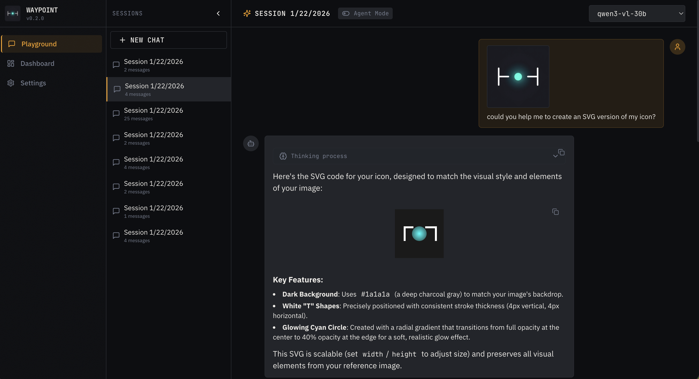
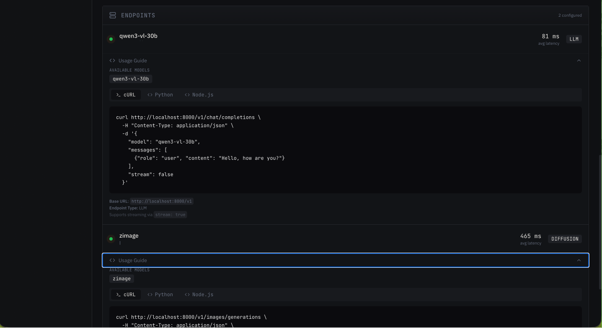
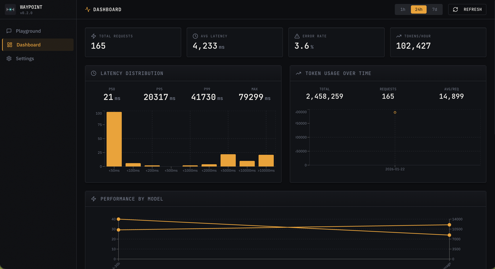
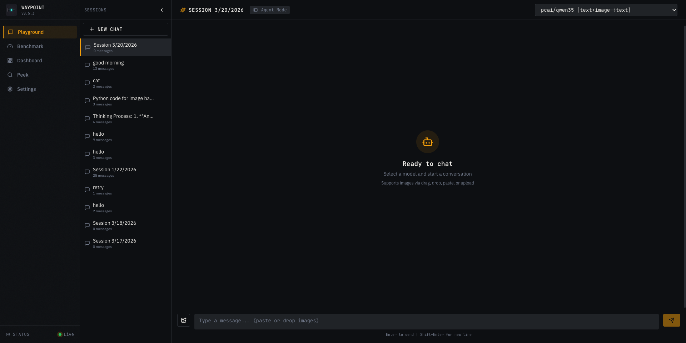
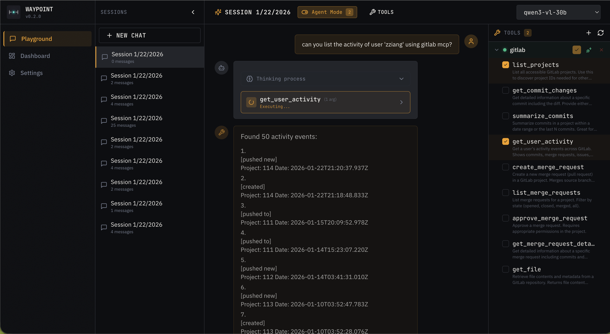
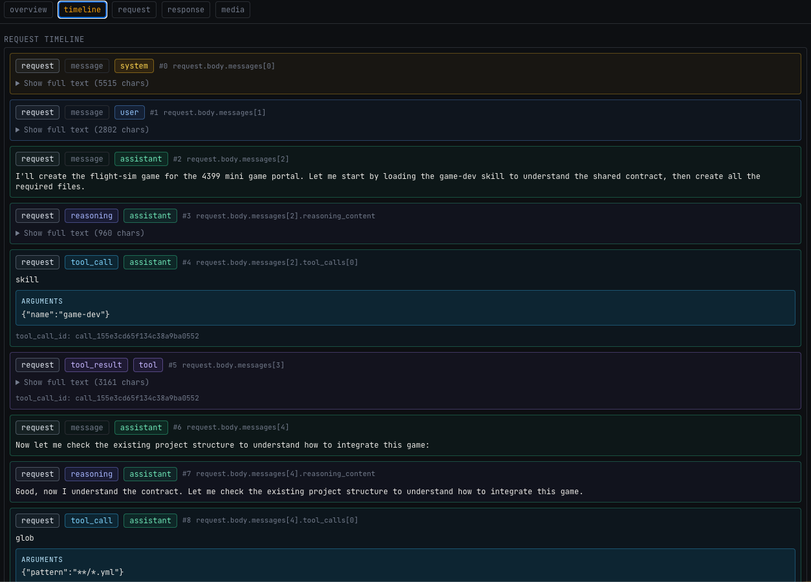
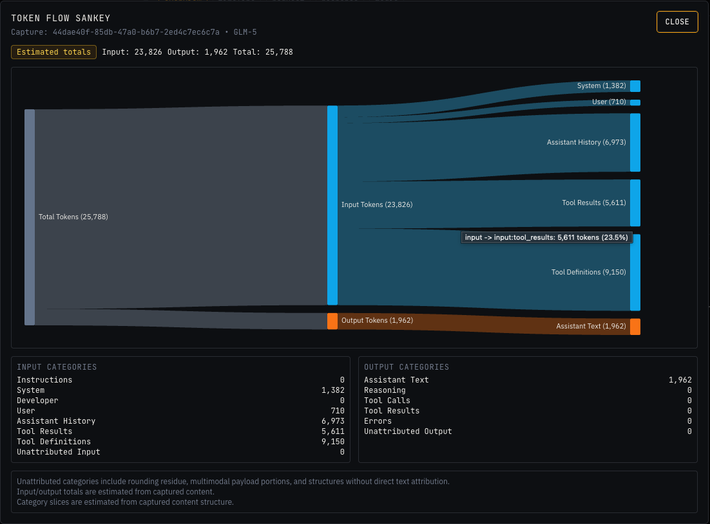

<p align="center">
  
</p>

<h1 align="center">Waypoi</h1>

<p align="center">
  <strong>Local AI Gateway</strong> — OpenAI-compatible proxy with intelligent routing, failover, and a built-in playground UI for agentic workflows.
</p>

<p align="center">
  <em>Sometimes a good LLM endpoint works behind a bad SSL cert. Waypoi bridges the gap—connect to any backend, handle SSL issues gracefully, and unify multiple endpoints behind one secure local interface.</em>
</p>

---

## Screenshots

### Playground
<p align="center">
  
</p>

### Agent Mode with Tool Calling
<p align="center">
  
</p>

### Endpoint Proxy & Usage Guides
<p align="center">
  
</p>

### Dashboard
<p align="center">
  
</p>

### MCP Image Generation
<p align="center">
  
</p>

### MCP Image Understanding
<p align="center">
  
</p>

### Token Flow Sankey
<p align="center">
  
</p>

### Naming and Logo

I admit, the name "Waypoi" is proposed by LLM (shut out to Qwen3-vl-30B) after it reads my early repositoy. In the beginning, the work was just intended to be a simple proxy for ill-configured LLM endpoints. I am talking about PCAI.

At the time, way point was just a term, similar to "route point", providing access to the LLM endpoints.

As I learn more about the AI agents, I start to be convinced the name do has more meanings. AI agents are clearly a waypoi to the future AGI, superintelligence or singularity. I hope this project can be my stepping stone to that future.

But I feel I am not smart enough to do it by myself. In this sense, the project can provide a helping waypoi betwen me and a smarter me, what I projected myself in my tiny mind.

I asked the LLM (thanks again qwen3-vl-30B) to design a logo prompt and `zimage` to generate the logo. After several rounds of judging, the winner comes with the following prompt:

> Minimal abstract gateway icon, two vertical parallel lines with a glowing orb passing through center, neon cyan accent on dark background, geometric precision, symbolizing data flow through a unified portal, clean vector style, icon design

Suprisingly, the logo looks like a layed down box plot. 

Here is the ascii art version of the logo:

```
├─o─┤
```

---

## Features

| Feature | Description |
|---|---|
| **Reverse Proxy** | Route LLM, diffusion, audio, and embedding requests to multiple backends behind a single OpenAI-compatible API |
| **Health-Based Failover** | Automatic retry with circuit breaker, latency-aware routing, and per-endpoint TLS policy |
| **Smart Pools** | Virtual model aliases (e.g. `smart`) that load-balance across providers matching capability requirements |
| **Web Playground** | Chat interface with session history, image upload, streaming, voice call mode, and agentic tool use |
| **Agent Mode** | Built-in MCP (Model Context Protocol) client — connect external servers or use the built-in `/mcp` endpoint; tools auto-connected and pre-selected on startup |
| **Built-in MCP Tools** | `generate_image` (diffusion routing, file output to `~/.config/waypoi`) and `understand_image` (vision model analysis with geometry metadata) |
| **Model Capability Matrix** | Per-model input/output modality classification (`text`, `image`, `audio`, `embedding`, `reasoning`) with configured or inferred sources |
| **Provider Catalog** | First-class provider and model management in both Settings and CLI, including curated free-provider presets, ranked model discovery, and provider-first routing |
| **Responses API Shim** | `/v1/responses` compatibility shim translates Responses-style requests to chat completions with SSE event mapping |
| **Benchmark Showcase** | Live example replays and diagnostic suites via `waypoi bench`; supports file-driven scenarios, baselines, and per-model targeting |
| **Peek** | Request-capture browser with calendar view, timeline inspection, media artifacts tab, and token-flow Sankey visualization |
| **Statistics** | Per-model/endpoint request tracking with 7-day window, latency distribution, token usage charts, and CLI summaries |
| **Usage Guides** | Dashboard-embedded copy-paste code snippets (cURL, Python, Node.js) for every proxied endpoint |
| **Hot Reload** | Config changes apply without restart via filesystem watcher |
| **Auth Ready** | Optional token-based authentication (disabled by default); MCP endpoint is always localhost-only |

## Architecture

```
┌─────────────────────────────────────────────────────────────────────┐
│                           Waypoi Gateway                          │
├─────────────────────────────────────────────────────────────────────┤
│  Routes:                                                            │
│    /v1/chat/completions    → LLM backends                          │
│    /v1/embeddings          → Embedding backends                     │
│    /v1/images/*            → Diffusion backends                     │
│    /v1/audio/*             → Audio backends (TTS/STT)               │
│    /v1/models              → Aggregated model list                  │
│    /v1/responses           → Responses API shim                     │
│    /mcp                    → Built-in MCP tool server               │
│                                                                     │
│  Admin:                                                             │
│    /admin/endpoints        → Endpoint CRUD                          │
│    /admin/health           → Health status                          │
│    /admin/stats            → Request statistics                     │
│    /admin/sessions         → Chat session storage                   │
│    /admin/mcp/*            → MCP server management                  │
│                                                                     │
│  UI:                                                                │
│    /ui                     → React playground & dashboard           │
├─────────────────────────────────────────────────────────────────────┤
│  Storage (~/.config/waypoi):                                      │
│    config.yaml       │ Endpoint configuration                       │
│    health.json       │ Health state cache                           │
│    stats/*.jsonl     │ Request logs (30-day rotation)               │
│    sessions/*.json   │ Chat session history                         │
│    images/           │ AIGC image cache (LRU, 1GB default)          │
│    mcp-servers.yaml  │ MCP server registry                          │
└─────────────────────────────────────────────────────────────────────┘
```

## Quickstart

```bash
# Install dependencies
npm install
cd ui && npm install && cd ..

# Build
npm run build:all

# Start server
npm run start
```

Open http://localhost:9469/ui for the web interface.

## Add Providers and Models

Waypoi is now provider-first. The recommended setup flow is:

1. Add or import a provider
2. Discover or add models under that provider
3. Use canonical model IDs like `provider/model` or the `smart` pool alias

## Free LLM Providers

Waypoi includes a curated **Free LLM providers** catalog sourced from TypeScript sources in [`src/providers/catalog/`](/Users/zziang/Documents/Projects/waypoi/src/providers/catalog/). This catalog is used in two places:

- the Settings UI `Catalog` tab when adding a provider
- the CLI import path via `waypoi providers import -f .env`

The catalog data is defined as TypeScript modules, one per provider, with verified rate limit metadata. A YAML-based fallback exists in the local [`references/`](/Users/zziang/Documents/Projects/waypoi/references) registry for backwards compatibility.

The goal is to make free-tier providers easy to try without manually copying endpoints, auth types, or starter model metadata.

What the catalog includes:

- provider presets for publicly documented free-tier LLM APIs
- provider metadata such as docs links, auth shape, basic limits, and model counts
- per-model rate limits where available (Groq, Cerebras), provider-level fallback otherwise
- curated model metadata used for ranking and discovery
- discovery configuration for dynamic model and rate limit probing

How compatibility works:

- `Ready now` means the provider can be added directly into Waypoi's current provider framework
- `Coming soon` means the provider is kept in the catalog, but its upstream protocol is not fully integrated into Waypoi yet

Today, the best-supported free-provider flow is for providers that already fit Waypoi's implemented protocols and discovery behavior, especially OpenAI-compatible ones. The catalog is still shown for broader free-tier coverage so users can see what is planned next.

### Current Support and Roadmap

| Provider | Status | Notes |
|---|---|---|
| Cerebras | Supported now | OpenAI-compatible provider in the current framework |
| GitHub Models | Supported now | Discovery uses provider-specific fallback behavior |
| Groq | Supported now | OpenAI-compatible provider with per-model rate limits and dynamic discovery |
| HuggingFace | Supported now | OpenAI-compatible router/gateway integration |
| Mistral | Supported now | OpenAI-compatible provider in the current framework |
| NVIDIA NIM | Supported now | OpenAI-compatible provider with large discovered model catalog |
| OpenRouter | Supported now | OpenAI-compatible gateway with large free-model catalog |
| Gemini | Supported now | Native `gemini` protocol using `/models` discovery and `generateContent` / `streamGenerateContent` chat routing |
| Cloudflare Workers AI | Supported now | Native `cloudflare` protocol using account-scoped `/ai/v1` chat routing and `/ai/models/search` discovery |
| Ollama Cloud | Supported now | Native `ollama` protocol using `/api/chat` routing and `/api/tags` discovery |

Support status here is about **Waypoi integration**, not whether the upstream service account is automatically usable. You still need a valid provider token, and each provider may enforce its own limits, allowlists, or account requirements.

### With the UI

Open `http://localhost:9469/ui`, then go to `Settings`.

For provider setup:

- Click `Add Provider`
- Use the `Catalog` tab to browse curated free-provider presets sourced from `references/`
- Search presets, inspect compatibility, and choose `Use Preset` for providers marked `Ready now`
- Review the pre-filled provider form and save it
- For unsupported protocols, the preset remains visible as `Coming soon`

For model setup:

- Expand the provider row and click `Add Model`
- Use `Discover` to fetch upstream models from `/v1/models`
- Search large model lists, filter by type/capabilities, and use the recommended ranking view
- Select a discovered model to pre-fill the model form, then save

### Without the UI

Use the CLI with the provider-first workflow.

For curated free providers (TypeScript-first catalog with verified rate limits):

```bash
# Import the curated registry and load credentials from .env
waypoi providers import -f .env

# Inspect imported providers
waypoi providers
waypoi providers show openrouter

# Discover models dynamically from provider APIs
waypoi providers discover groq
waypoi providers discover groq --limits --model llama-3.3-70b-specDEC
waypoi providers discover cerebras --api-key $CEREBRAS_API_KEY

# Inspect provider models
waypoi models openrouter
waypoi models show openrouter/openai-gpt-oss-120b
```

For manual provider/model setup:

```bash
# Add or update a provider through the provider-first commands/docs
# then add models beneath it
waypoi models add <providerId> --model-id <id> --upstream <provider-model-name> --base-url <url>
waypoi models update <providerId> <modelRef> [patch options]
```

Imported providers use the TypeScript catalog sources in `src/providers/catalog/` as the primary metadata source, with verified per-model rate limits. The legacy YAML-based `references/` registry remains as a fallback.

Notes for free providers:

- some providers expose standard `/v1/models` discovery
- some require discovery fallbacks such as `/models`
- some are cataloged for visibility but are not yet directly routable in Waypoi
- free-tier availability, limits, and access policies still depend on the upstream provider account and token

## Legacy Endpoint Commands

```bash
# Via CLI
waypoi add \
  --name local-llm \
  --url http://localhost:11434 \
  --priority 1 \
  --type llm \
  --model local-default=llama3

# Diffusion endpoint
waypoi add \
  --name local-sd \
  --url http://localhost:7860 \
  --priority 1 \
  --type diffusion \
  --model sd-xl=stable-diffusion-xl
```

## OpenAI-Compatible Endpoints

| Endpoint | Description |
|----------|-------------|
| `POST /v1/chat/completions` | Chat with streaming and tool calling |
| `POST /v1/embeddings` | Text embeddings for RAG |
| `GET /v1/models` | List available models |
| `POST /v1/images/generations` | Image generation |
| `POST /v1/images/edits` | Image editing |
| `POST /v1/audio/transcriptions` | Speech-to-text |
| `POST /v1/audio/speech` | Text-to-speech |
| `POST /v1/responses` | Responses API shim |
| `POST /mcp` | Built-in MCP service endpoint |

Native websocket passthrough:

- `GET /api-ws/v1/realtime?model=...` upgrades to a local WebSocket proxy for DashScope realtime ASR.

`GET /v1/models` includes both legacy `endpoint_type` and detailed `capabilities` metadata when available.

### Responses API Shim

Waypoi exposes `/v1/responses` as a compatibility shim for clients that use Responses-style requests.
Internally, requests are translated to chat completions and routed through the same failover path.

Key behavior:

- `input_text` / `output_text` content parts are normalized to `text`
- function call payloads are mapped to OpenAI tool-call shape
- `developer` role is normalized to `system`

For `stream: true`, Waypoi emits Responses-style SSE events (`response.created`, deltas, output items, and `response.completed`).

## Admin Endpoints

| Endpoint | Description |
|----------|-------------|
| `GET /admin/endpoints` | List all endpoints |
| `POST /admin/endpoints` | Add endpoint |
| `PATCH /admin/endpoints/:id` | Update endpoint |
| `DELETE /admin/endpoints/:id` | Remove endpoint |
| `GET /admin/health` | Health status by endpoint |
| `GET /admin/stats` | Aggregated statistics |
| `GET /admin/stats/latency` | Latency distribution |
| `GET /admin/stats/tokens` | Token usage over time |
| `GET/POST/DELETE /admin/sessions` | Chat session CRUD |
| `GET/POST/DELETE /admin/mcp/servers` | MCP server CRUD |
| `GET /admin/mcp/tools` | List discovered tools |
| `POST /admin/mcp/tools/execute` | Execute a tool |
| `GET /admin/provider-catalog?source=free` | Curated free-provider preset catalog |
| `GET /admin/providers` | Provider catalog |
| `GET /admin/providers/:id` | Provider details |
| `GET /admin/pools` | Smart pool definitions |
| `POST /admin/pools/rebuild` | Rebuild smart pools from providers |

## DashScope Native Support

Waypoi standardizes Alibaba Model Studio through the `dashscope` provider protocol:

- Qwen image generation and image editing use DashScope multimodal image APIs behind the existing OpenAI-compatible `/v1/images/*` routes.
- Wan video generation uses the current DashScope async video API behind `POST /v1/videos/generations`.
- File transcription stays on `POST /v1/audio/transcriptions`.
- Realtime ASR is exposed as a native local websocket passthrough at `ws://localhost:9469/api-ws/v1/realtime?model=<model>`.

Example provider config:

- [examples/providers/alibaba-dashscope.yaml](/Users/zziang/Documents/Projects/waypoi/examples/providers/alibaba-dashscope.yaml)

## Built-In MCP Service (`/mcp`)

Waypoi exposes a first-party MCP server for local agent-to-tool workflows without going through chat models.

- Endpoint: `POST /mcp` (Streamable HTTP MCP transport)
- Access: localhost only (`localhost`, `127.0.0.1`, `::1`)
- Auth: intentionally open on localhost, even when `authEnabled=true`

Client flow:
1. `initialize`
2. `notifications/initialized`
3. `tools/list`
4. `tools/call`

Initial built-in tool:
- `generate_image`
  - Generates image(s) using Waypoi's diffusion routing
  - Depends on at least one live diffusion-capable model
  - Always writes generated files to `~/.config/waypoi/generated-images` by default
  - Override output location with `WAYPOI_MCP_OUTPUT_ROOT` (and optionally `WAYPOI_MCP_OUTPUT_SUBDIR`)
  - Returns structured result with model metadata plus `file_path` or `file_paths` relative to the output root; raw `url`/`b64_json` are optional via `include_data`
- `understand_image`
  - Performs image-to-text understanding with a vision-capable model
  - Supports `image_path` or `image_url` input with top-level `text` plus structured `result` output (`ocr_text`, objects, scene, details)
  - For local `image_path` inputs, preserves original image geometry and reports optional `image_geometry` metadata so coordinate-based tasks stay aligned with the source file

Agent defaults (summary):
1. Keep `include_data=false` unless inline image payload is explicitly required.
2. Set `WAYPOI_MCP_OUTPUT_ROOT` if you want images written to a specific location.

Example `generate_image` tool call:

```json
{
  "name": "generate_image",
  "arguments": {
    "prompt": "Minimal icon with clean geometric shape"
  }
}
```

Example `understand_image` coordinate-sensitive prompt:

```json
{
  "name": "understand_image",
  "arguments": {
    "image_path": "./assets/layout.png",
    "instruction": "Return the center point of the submit button as JSON with x and y in original image pixels."
  }
}
```

Canonical MCP governance and behavior contract: [`docs/mcp-guidelines.md`](docs/mcp-guidelines.md).  
Detailed MCP tool contract and examples: [`docs/mcp-service.md`](docs/mcp-service.md).

## CLI Commands

```bash
# Endpoint management
waypoi ls                           # List endpoints
waypoi add --name --url --priority  # Deprecated (blocked in provider-first mode)
waypoi rm <id|name>                 # Deprecated (blocked in provider-first mode)
waypoi edit                         # Deprecated (blocked in provider-first mode)
waypoi stat                         # Run health check
waypoi test <model>                 # Test a model
waypoi acct                         # Token usage by endpoint

# Service management
waypoi service start                # Start background service
waypoi service stop                 # Stop service
waypoi service restart              # Restart service
waypoi service status               # Check if running

# Logs & stats
waypoi logs                         # Show last 50 log lines
waypoi logs -f                      # Follow log output
waypoi stats                        # Show 7-day statistics
waypoi stats --window=24h           # Custom time window
waypoi stats --json                 # JSON output

# MCP server management
waypoi mcp add --name --url         # Add MCP server
waypoi mcp list                     # List MCP servers
waypoi mcp rm <id|name>             # Remove MCP server
waypoi mcp enable <id|name>         # Enable server
waypoi mcp disable <id|name>        # Disable server

# Provider catalog + smart pools
waypoi providers                    # List providers (canonical)
waypoi providers import -f .env     # Import curated providers from references/ and load credentials
waypoi providers show <providerId>  # Show one provider
waypoi providers discover <providerId>           # Discover models from provider API
waypoi providers discover <providerId> --limits   # Probe rate limit headers
waypoi providers update <providerId> --insecure-tls|--strict-tls
waypoi providers update <providerId> --auto-insecure-domain ai-application.stjude.org
waypoi providers enable <providerId> # Enable provider
waypoi providers disable <providerId># Disable provider
waypoi providers migrate-endpoints --provider pcai --match-domain ai-application.stjude.org --protocol openai
waypoi providers pools              # List smart pools

# Models (one-hop by provider)
waypoi models                       # List models across providers
waypoi models pcai                  # List models for provider
waypoi models show pcai/gpt-4o      # Show one model
waypoi models add <providerId> --model-id <id> --upstream <name> --base-url <url>
waypoi models update <providerId> <modelRef> [patch options]
waypoi models rm <providerId> <modelRef>
waypoi models enable pcai/gpt-4o
waypoi models disable pcai/gpt-4o
waypoi models set-key pcai/gpt-4o --api-key <key>|--env-var <ENV>

# Benchmark showcase
waypoi bench                               # Default live showcase example suite
waypoi bench --suite showcase --model smart --temperature 0
waypoi bench --list-examples               # Advanced: list showcase examples
waypoi bench --example showcase-tinyqa-001 # Advanced: narrow to one example
waypoi bench --scenario file.json          # Advanced: file-driven scenarios
waypoi bench --mode diagnostic --suite pool_smoke
waypoi bench --baseline ./bench-prev.json
```

Benchmark showcase examples are sourced from Hugging Face dataset
`vincentkoc/tiny_qa_benchmark` (train split, 52 QA prompts).
Admin/API benchmark runs prefer `{ "model": "...", "suite": "...", "parameters": { ... } }`;
the older wide request shape remains available for advanced workflows.

Provider credentials imported with `waypoi providers import -f .env` are stored in plaintext at
`$WAYPOI_DIR/providers.json` by design for local operation.

### Canonical Provider-First Workflow

Use these commands as the primary operational path:

1. `waypoi providers`
2. `waypoi providers show <providerId>`
3. `waypoi models`
4. `waypoi models <providerId>`
5. `waypoi models show <providerId>/<modelId>`

Legacy `waypoi provider ...` and `waypoi provider model ...` forms are rewritten to canonical commands with a deprecation warning. Set `WAYPOI_NO_WARN=1` to suppress legacy rewrite warnings in scripts.

TLS policy is provider-first:
- Provider `insecureTls` is the default for all provider models.
- Model `insecureTls` is an optional override (`--clear-insecure-tls` restores inheritance).
- Optional provider allowlist (`autoInsecureTlsDomains`) enables one-time TLS verify fallback and persists model override on successful retry.

Endpoint migrations use copy-then-disable semantics for rollback safety. Migrated source endpoints
stay in `config.yaml` with `disabled: true` and can be re-enabled if needed.

Detailed benchmark format and assertions: [`docs/benchmark.md`](docs/benchmark.md).
Provider protocol adapter onboarding (including `inference_v2`): [`docs/providers.md`](docs/providers.md).

## External Client Integration (Opencode)

Waypoi is a local AI gateway for external clients. Configure Opencode (or other OpenAI-compatible clients) to use:

- Base URL: `http://localhost:9469/v1`
- API key: `local-dev` (or your configured token)
- Model: `smart` (recommended default free-model pool alias)
- Note: legacy `smart-*` aliases are removed; use `smart` or canonical `provider/model` IDs.

Protocol note: non-OpenAI upstreams are adapter-backed. `inference_v2` is supported in sync mode
for `/v1/chat/completions` (text + optional image), while keeping external OpenAI-compatible calls.

See [`docs/opencode.md`](docs/opencode.md) for setup details.

## Web UI

Access the playground at `http://localhost:9469/ui`:

- **Playground** — Chat interface with session history, image upload (VL models), and agent mode
- **Dashboard** — Real-time stats with latency charts, token usage, endpoint health, and **usage guides** with copy-paste code snippets (cURL, Python, Node.js)
- **Peek** — Calendar browser for captured requests, timeline inspection, media artifacts, and token-flow analysis
- **Settings** — Provider/model catalog management, curated free-provider presets, ranked model discovery, MCP guidance, and image defaults

### Settings Provider Workflow

The `Settings` page now supports two provider onboarding modes:

- `Catalog` — curated free-provider presets from `references/`, with compatibility labels like `Ready now` and `Coming soon`
- `Manual` — direct provider entry for custom or private backends

After adding a provider, `Add Model` supports:

- upstream model discovery from `/v1/models`
- inline search for large provider catalogs
- ranking that prefers free-tier matches, higher `benchmark.livebench` scores, and richer capabilities
- filters for endpoint type, tools, vision, streaming, and free-only results

### Endpoint Usage Guides

Each endpoint in the Dashboard includes an expandable "Usage Guide" dropdown showing:
- **cURL** — Command-line examples for quick testing
- **Python** — OpenAI SDK code with your proxy URL
- **Node.js** — TypeScript/JavaScript examples

All code snippets use `localhost:PORT` (your proxy) instead of the upstream endpoint, so you can copy-paste and run immediately.

### Agent Mode

Toggle "Agent Mode" in the playground to enable tool calling:

1. Add MCP servers via UI or CLI
2. Connect to discover available tools
3. Select which tools to enable
4. Chat normally — the agent will use tools when appropriate

The agentic loop supports up to 10 tool iterations per message.

### Peek

Peek is the request-capture browser for debugging prompts, routing, tool use, and media-heavy interactions:

- **Calendar browse** — move day by day through captured traffic
- **Timeline view** — inspect ordered request and response segments, including assistant reasoning/tool-call structure
- **Request/Response tabs** — compare raw payloads and normalized previews
- **Media tab** — review persisted images and other artifacts
- **Token Flow Sankey** — visualize where captured input/output tokens were attributed

Timeline inspection example:



Token-flow Sankey example:



### Statistics

Waypoi exposes request statistics in both CLI and UI:

- `waypoi stats` for aggregated CLI summaries
- Dashboard cards and charts for latency, throughput, errors, and token usage
- `/admin/stats` for aggregate windows
- `/admin/stats/latency` for latency distribution buckets
- `/admin/stats/tokens` for token usage over time

Statistics are derived from the local JSONL request log store with retention-based rotation. Use them to validate routing changes, benchmark regressions, and slow/failing upstream behavior.

## Configuration

### config.yaml

```yaml
endpoints:
  - name: openai
    baseUrl: https://api.openai.com
    apiKey: sk-...
    priority: 1
    type: llm
    models:
      - publicName: gpt-4
        upstreamModel: gpt-4-turbo
        capabilities:
          input: [text]
          output: [text]
      - publicName: qwen3-vl
        upstreamModel: qwen3-vl
        capabilities:
          input: [text, image]
          output: [text]
  
  - name: local-sd
    baseUrl: http://localhost:7860
    priority: 1
    type: diffusion
    models:
      - publicName: sd-xl
        upstreamModel: stable-diffusion-xl-base-1.0
        capabilities:
          input: [text]
          output: [image]

# Enable authentication (default: false)
authEnabled: false
```

`capabilities` is optional. If omitted, Waypoi infers capabilities from model metadata/name and endpoint type.

### Environment Variables

| Variable | Default | Description |
|----------|---------|-------------|
| `PORT` | `9469` | Server port |
| `ADMIN_TOKEN` | — | Bearer token for admin endpoints |
| `WAYPOI_DIR` | `~/.config/waypoi` | Storage directory |
| `WAYPOI_CONFIG` | `{dir}/config.yaml` | Config file path |
| `WAYPOI_DEBUG_ERRORS` | `0` | Set to `1` for verbose internal error logs |

## Storage

All data is stored in `~/.config/waypoi` (or `$WAYPOI_DIR`):

| File/Directory | Purpose |
|----------------|---------|
| `config.yaml` | Endpoint configuration |
| `health.json` | Cached health state |
| `stats/` | JSONL stats files (30-day retention) |
| `sessions/` | Chat session JSON files |
| `images/` | AIGC image cache (1GB LRU) |
| `benchmarks/` | Benchmark reports |
| `mcp-servers.yaml` | MCP server registry |
| `waypoi.pid` | Service PID file |
| `waypoi.log` | Service log file |

## Development

```bash
# Run in development mode
npm run dev

# Build
npm run build

# Run tests
npm test

# Lint
npm run lint
```

## Authentication

Authentication is disabled by default. To enable:

1. Set `authEnabled: true` in `config.yaml`
2. Restart (or wait for hot-reload)
3. Include `Authorization: Bearer <token>` header

The auth middleware protects `/admin/*` and `/ui/*` routes.

## Manual Testing

```bash
# Test chat completions
curl http://localhost:9469/v1/chat/completions \
  -H "Content-Type: application/json" \
  -d '{"model": "local-default", "messages": [{"role": "user", "content": "Hello"}]}'

# Test image generation
curl http://localhost:9469/v1/images/generations \
  -H "Content-Type: application/json" \
  -d '{"model": "sd-xl", "prompt": "A sunset over mountains"}'

# Run manual test script
BASE_URL=http://localhost:9469 MODEL=local-default npm run manual-test
```

## License

MIT
